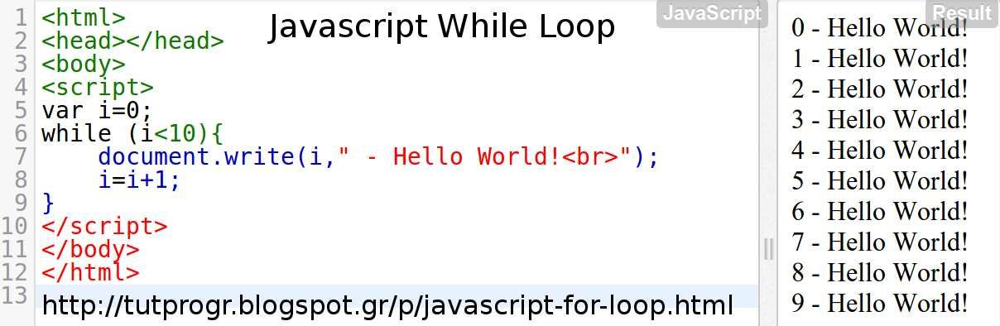

# HTML Lists, Control Flow with JS, and the CSS Box Model

## Lists
* Three different types:
1. Ordered lists are lists where each item in the list is numbered. 
2. Unordered lists are lists that begin with a bullet point.
3. Definition lists are made up of a set of terms along with the definitions for each of those terms.

## Ordered Lists
* The ordered list is created with the < ol> element.
* Each item in the list is placed in between an opening < li> tag and a closing </ li> tag.

[List](images/list.jpg)

## Unordered Lists
* The unordered list is created with the < ul> element.
* Each item in the list is placed between an opening < li> tag and a closing </ li> tag.

[Unordered-List](images/unordered-list.jpg)

## Definition Lists
* **< dl>** The definition list is created with the < dl> element and usually consists of a series of terms and their definitions.

* **<dt>** This is used to contain the term being defined.

* **dd** This is used to contain the definition.

[Definition-lists](images/definition-of-list.jpg)

## Nested List
* You can put a second list inside an < li> element to create a sublist or nested list.

[Nested-List](images/nested-list.jpg)

***
***

## Boxes
* You can set several properties that affect the appearance of these boxes:
1. Control the dimensions of your boxes.
2. Create borders around boxes.
3. Set margins and padding for boxes.
4. Show and hide boxes.

## Box Dimensions
* Width, Height
1. To set your own dimensions for a box you can use the height and width properties.
2. The most popular ways to specify the size of a box are to use pixels, percentages, or ems.

[Box-Dimensions](images/box-dimensions.jpg)

## Limiting Width
* min-width, max-width
1. The min-width property specifies the smallest size a box can be displayed at when the browser window is narrow,

2. The max-width property indicates the maximum width a  box can stretch to when the browser window is wide.

[Limiting-Width](images/limiting-width.jpg)

## Limiting Height
* In the same way that you might want to limit the width of a box on a page, you may also want to limit the height of it.

[limiting-height](images/limiting-height.jpg)

## Overflowing Content
* The overflow property tells the browser what to do if the content contained within a box is larger than the box itself.
* It can have one of two values:
1. **hidden** : This property simply hides any extra content that does not fit in the box.
2. **Scroll** : This property adds a scrollbar to the box so that users can scroll to see the missing content.

## Border, Margin & Padding

[Borders](images/borders.jpg)

## White space & Vertical Margin
* The padding and margin properties are very helpful in adding space between various items on the page.

## Border Width
* The border-width property is used to control the width of a border.

* The value of this property can be given in pixels or using one of the following values:
1. thin
2. medium
3. thick

* You can control the individual size of borders using four separate properties:
1. border-top-width
2. border-right-width
3. border-bottom-width
4. border-left-width

## Border Style
This property can take the following values:
1. **solid** a single solid line
2. **dotted** a series of square dots
3. **dashed** a series of short lines
4. **double** two solid lines
5. **groove** appears to be carved into the page
6. **ridge** appears to stick out from the page
7. **inset** appears embedded into the page outset looks like it is coming
8. **outset** of the screen
9. **hidden / none** no border is shown

* You can individually change the styles of different borders using:
1. border-top-style
2. border-left-style
3. border-right-style
4. border-bottom-style

## Border Color
* You can specify the color of a border using either RGB values, hex codes or CSS color names

* It is possible to individually control the colors of the borders on different sides of a box using:
1. border-top-color
2. border-right-color
3. border-bottom-color
4. border-left-color

* It is also possible to use a shorthand to control all four border colors in the one property: border-color: top right bottom left

## Shorthand border
* The border property allows you to specify the width, style and color of a border in one property.

## Padding
* The padding property allows you to specify how much space should appear between the content of an element and its border, and most often specified in **pixels** .

## Margin
* controls
the gap between boxes. Its value is commonly given in pixels, although you may also use percentages or ems.

* If one box sits on top of another, margins are collapsed , which means the larger of the two margins will be used and the smaller will be disregarded.

## Centring Content
* If you want to center a box on the page (or center it inside the element that it sits in), you can set the *left-margin* and *right-margin* to **auto**.

* In order to center a box on the page, you need to set a width for the box (otherwise it will take up the full width of the page).

## IE6 Box Model
* When you specify the width of a box, any padding or margin should be added to the width of it.

## Change INLINE/Block
* The display property allows you to turn an inline element into a block-level element or vice versa, and can also be used to hide an element from the page.

* The values this property can take are:
1. **inline** : This causes a block-level element to act like an inline element.
2. **block** : This causes an inline element to act like a block-level element.
3. **inline-block** : This causes a block-level element to flow like an inline element, while retaining other features of a block-level element.
4. **none** : This hides an element from the page. In this case, the element acts as though it is not on the page at all (although a user could still see the content of the box if they used the view source option in their browser).

## Hiding BOXES
* The visibility property allows you to hide boxes from users but It leaves a space where the element would have been.

* This property can take two values:
1. **hidden** : This hides the element.
2. **visible** : This shows the element.

# CSS3 :

## Border Image
* The border-image property applies an image to the border of any box. It takes a background image and slices it into nine pieces.

* This property requires three pieces of information:
1. The URL of the image
2. Where to slice the image
3. What to do with the straight edges; the possible values are:
    * stretch stretches the image
    * repeat repeats the image
    * round like repeat but if the tiles do not fit exactly, scales the tile image so they will.

## Box Shadows
* The box-shadow property allows you to add a drop shadow around a box.

* It must use at least the first of these two values as well as a color:
1. Horizontal offset Negative values position the shadow to the left of the box.
2. Vertical offset Negative values position the shadow to the top of the box.
3. Blur distance If omitted, the shadow is a solid line like a border.
4. Spread of shadow If used, a positive value will cause the shadow to expand in all directions, and a negative value will make it contract.

## Rounded Corners
* you can create rounded corners on any box, using a property called border-radius. The value indicates the size of the radius in pixels.

* You can specify individual values for each corner of a box using:
1. border-top-right-radius
2. border-bottom-right-radius
3. border-bottom-left-radius
4. border-top-left-radius

## Elliptical Shapes
* To create more complex shapes, you can specify different distances for the horizontal and the vertical parts of the rounded corners.

***

***

***

## ARRAYS
* An array is a special type of variable. It doesn't just store one value; it stores a list of values.

* Arrays are especially helpful when you do not know how many items a list will contain because, when you create the array, you do not need to specify how many values it will hold.

* You create an array and give it a name (using the var keyword followed by the name of the array).

* The values are assigned to the array inside a pair of square brackets, and each value is separated by a comma. The values in the array do not need to be the same data type, so you can store a string, a number and a Boolean all in the same array, and its called **Array literal** .

* **Array constructor** : uses the new keyword followed by Array(); The va lues are then specified in parentheses (not square brackets), and each value is separated by a comma.

***

## If ... Else Statment
* The if...else statment check a condition, if it resolves to **true** the first code block is executed.
if the condition resolves to **false** the second code block is run instead.

[If-Else-statment](if-else.jpg)

* USING IF ... ELSE STATEMENTS
if ... else statement al lows you to provide two sets of code:
1. one set if the condition evaluates to true.
2. another set if the condition is false.

[If-Else-Example](images/if-example.jpg)

## SWITCH STATEMENTS
* A switch statement starts with a variable called the **switch value**. Each case indicates a possible value for this variable and the code that should run if the variable matches that value.

[Switch](images/switch.jpg)

[If-Else.vs.Switch](images/if-switch.jpg)

* USING SWITCH STATEMENTS
The purpose of the switch statement is to present the user with a different message depending on which level they are at.

## TYPE COERCION & WEAK TYPING
* If you use a data type JavaScript did not expect, it tries to make sense of the operation rather than report an error.

* **Type Coerction** : convert data types behind the scenes to complete an operation.

* JavaScript is said to use weak typing because the data type for a value can change.

[Data-Type](images/data-type/jpg)

## TRUTHY & FALSY VALUES
* Due to type coercion, every value in JavaScript can be treated as if it were true or false; and this has some interesting side effects.

* *Falsy values* are treated as if they are false.
* *Falsy values* can also be treated as the number 0 .

[Falsy-VALUE](images/falsy-value.jpg)

* *Truthy values* are treated as if they are true.
* *Truthy* values can also be treated as the number 1.

[Truthy-Value](images/truthy-value.jpg)

## CHECKING EQUALITY & EXISTENCE
* A **unary operator** returns a result with just one operand.

* Because of **type coercion**, the strict **equality operators** *===* and *! ==* result in fewer unexpected values than *==* and *! = do*.

[Checking-Equality](images/checking-equality.jpg)

## SHORT CIRCUIT VALUES
* **Logical operators** are processed left to right.
They short-circuit (stop) as soon as they have a result - but they return the value that stopped the processing (not necessarily true or false). 

* Logical operators will not always return true or false, because:
    1. They return the value that stopped processing.
    2. That va lue might have been treated as truthy or falsy although it was not a Boolean.
* Programmers use this creatively (for example, to set values for variables or even create objects).

* As soon as a truthy value is found, the remaining options are not checked. Therefore, experienced programmers often:
1. Put the code most likely to return true first in OR operations, and false answers first in AND operations.
2. Place the options requiring the most processing power last, just in case another value returns true and they do not need to be run.

## Loops

* Loops check a condition. If it returns true, a code block will run, and so on will repeat until the condition returns fslse.

### Types of Loops:
1. For, used to run code a specific numbers of times.

2. While, if you don't know how many times the code should run.

3. Do While, similar to the while loops, but it will always run the statements inside the curly braces at least once, even the condition evalutes to fslse.

### Loops Counters
* **For** Loop uses a counter as a condution, and this tell the code to run a specified numbers of times.

* Statements of **For** Loop:
1. Initialization
    var i= 0;
2. Condition
    i < 9;
3. Update
    i++

* **While** Loop will continue to run for as long as the condition in parentheses is **true**.

* **DO WHILE**
    * The key difference between a whi 1 e loop and a do while loop is that the statements in the code block come before the condition.

