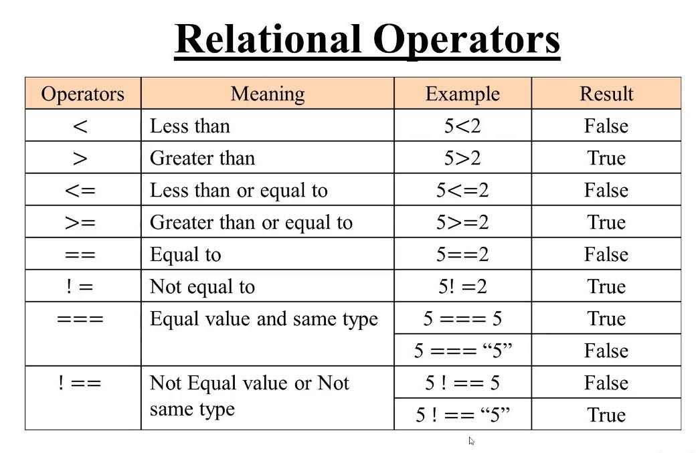
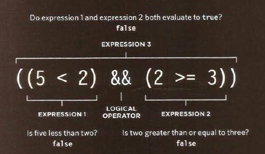
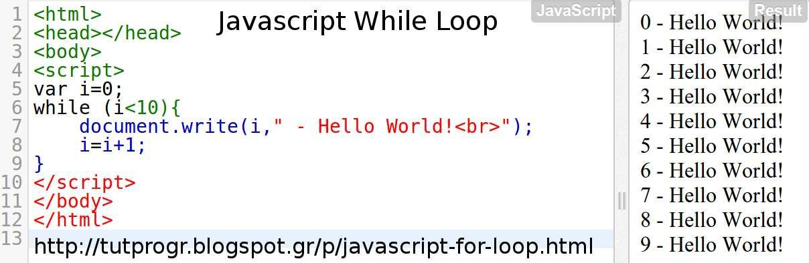

## Comparison Operators
1. Equal to " == "
* Operator compares two values ( numbers, strings,Booleans) to see if they are *the same*.

2. Not equal to "!="
* Operator compares two values ( numbers, strings,Booleans) to see if they are *not the same*.

3. Strict Equal to "==="
* Operator compares two check that both the data type and values are *the same*.

4. Strict not Equal to "!=="
* Operator compares two check that both the data type and values are *not the same*.

5. Greater than ">"
* Operator checks if the numbers on the lift is *greater than* the numbers on the right.

6. Less than "<"
* Operator checks if the numbers on the lift is *less than* the numbers on the right.

7. Greater than or equal ">="
* Operator checks if the numbers on the lift is *greater than or equal to* the numbers on the right.

8. Less than or equal to "<="
* Operator checks if the numbers on the lift is *less than or equal to* the numbers on the right.

***

## Logical Operators
* Comparison operators return single values of *true* or *false*.

1. Logical and "&&"
* The Operator tests more than one condition.

2. Logical Or "||"
* The Operator tests at least one condition.

3. Logical not "!"
* The Operator takes a single Boolean value and inverts it.

***

## Loops

* Loops check a condition. If it returns true, a code block will run, and so on will repeat until the condition returns fslse.

### Types of Loops:
1. For, used to run code a specific numbers of times.

2. While, if you don't know how many times the code should run.

3. Do While, similar to the while loops, but it will always run the statements inside the curly braces at least once, even the condition evalutes to fslse.

### Loops Counters
* **For** Loop uses a counter as a condution, and this tell the code to run a specified numbers of times.

* Statements of **For** Loop:
1. Initialization
    var i= 0;
2. Condition
    i < 9;
3. Update
    i++

* **While** Loop will continue to run for as long as the condition in parentheses is **true**.

